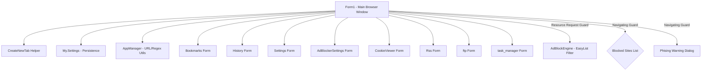

# K-Browser Codebase Documentation

K-Browser is a tabbed web browser application built using Visual Basic .NET (VB.NET) and Windows Forms. It integrates standard browsing features with advanced local utilities, such as a custom task manager, RSS reader, FTP client, AdBlocker engine, and security filtering.

---

## 🏛️ Application Architecture & Component Diagram

The following diagram illustrates how the forms, utility classes, ad blocking engine, and user settings interact within the application:

---

## 📂 Codebase Component Registry

| Component File | Type | Description |
| :--- | :--- | :--- |
| [Form1.vb](file:///c:/Users/dennis/Documents/GitHub/k-browser/Form1.vb) | Form | **Main Form**. Coordinates tab control creation, navigation, WebView2 event handlers, back/forward history, print dialogs, page zoom, quick bookmarking, and window sizing. Integrates security interceptors and the AdBlocker event handler. |
| [AdBlockEngine.vb](file:///c:/Users/dennis/Documents/GitHub/k-browser/AdBlockEngine.vb) | Class | **AdBlocker Engine**. Rule parser and resource evaluator supporting Whitelist rules (`@@`), Domain Anchors (`||`), and Substring rules. Features stylesheet/font protection (`ShouldBlockDomainOnly`), domain-option filtering (`$domain=`), generic path safeguards, and async list updater. |
| [AdBlockerSettings.vb](file:///c:/Users/dennis/Documents/GitHub/k-browser/AdBlockerSettings.vb) | Form | **AdBlocker Configuration**. UI for toggling filter list subscriptions (EasyList, EasyPrivacy, Fanboy's Annoyance), triggering list updates, and managing options. |
| [Settings.vb](file:///c:/Users/dennis/Documents/GitHub/k-browser/Settings.vb) | Form | **Configuration Panel**. Allows users to manage blocked/allowed site lists, toggle permissions (Geolocation, Notifications), enable phishing filter, and execute a TCP port scanner. |
| [AppManager.vb](file:///c:/Users/dennis/Documents/GitHub/k-browser/AppManager.vb) | Class | **Utilities**. Contains regex validators for URLs, IP addresses, and emails, along with URL scheme normalization (`FixURL`). |
| [History.vb](file:///c:/Users/dennis/Documents/GitHub/k-browser/History.vb) | Form | **History Manager**. Lists visited sites with formatted `"domain — Page Title"` text, parses ISO 8601 timestamps (`"Title|URL|DateTime"`), and provides Date Range filtering (*All Time, Today, Yesterday, Last 7 Days, Last 30 Days*). |
| [Bookmarks.vb](file:///c:/Users/dennis/Documents/GitHub/k-browser/Bookmarks.vb) | Form | **Bookmark Tree Manager**. Displays hierarchical bookmarks in a TreeView formatted as `"domain — Page Title"` while serializing clean titles (`BookmarkNodeData.Title`). Supports Drag-and-Drop tree reordering. |
| [Phising.vb](file:///c:/Users/dennis/Documents/GitHub/k-browser/Phising.vb) | Form | **Phishing Alert**. Decoupled warning dialog shown if the navigation guard intercepts a phishing URL. |
| [CookieViewer.vb](file:///c:/Users/dennis/Documents/GitHub/k-browser/CookieViewer.vb) | Form | **Cookie Manager**. Utility to browse and delete cookies from the local storage folder. |
| [ftp.vb](file:///c:/Users/dennis/Documents/GitHub/k-browser/ftp.vb) | Form | **FTP Client**. Client to list, upload, download, and delete files on remote FTP servers. |
| [task manager.vb](file:///c:/Users/dennis/Documents/GitHub/k-browser/task%20manager.vb) | Form | **Task Manager**. Lists active machine processes with memory usage and process termination capabilities. |
| [Rss.vb](file:///c:/Users/dennis/Documents/GitHub/k-browser/Rss.vb) | Form | **RSS Feed Reader**. Parses XML RSS feeds and presents headlines/links in an interactive tree structure. |
| [AboutBox.vb](file:///c:/Users/dennis/Documents/GitHub/k-browser/AboutBox.vb) | Form | **About Box**. Application metadata and version info dialog. |

---

## 🔒 Security, AdBlocker & Navigation Guard Design

### 1. Navigation & Phishing Guard
1. Navigation events (`NavigationStarting`) normalize target URLs against `BlockedSites` and `PhishingSites`.
2. If matched with `BlockedSites`, the navigation is cancelled (`e.Cancel = True`).
3. If matched with `PhishingSites`, the `Phising` warning form is displayed modally:
   - **Ignore and continue**: Temporarily adds the URL to the session `IgnoredUrls` cache.
   - **Back**: Aborts navigation.

### 2. Resource Interception & AdBlocker Architecture
1. `WebView2_WebResourceRequested` intercepts all sub-resource requests (`Image`, `Script`, `Stylesheet`, `Font`, `XHR`, `Other`).
2. Top-level page navigations (`CoreWebView2WebResourceContext.Document`) are **never** blocked.
3. **CSS & Typography Protection**: Page stylesheets (`Stylesheet`) and fonts (`Font`) are evaluated exclusively via `ShouldBlockDomainOnly()`. Generic path substring rules do not block main site CSS/fonts, preventing layout destruction on sites like Google Search / How Search Works.
4. **Rule Evaluation Pipeline (`AdBlockEngine.vb`)**:
   - **Whitelist (`@@`):** Overrides block rules.
   - **Domain Anchors (`||`):** Matches exact host signatures (`doubleclick.net`, `adservice.google.com`, etc.).
   - **Path Substrings:** Matches specific ad signatures (`ad_`, `_ad`, `/ad/`, `adserver`, `pagead`, `tracker`, `telemetry`, etc.) while protecting generic web paths (`css`, `style`, `assets`, `static`, `fonts`, `search`, `intl`, `about`).
   - **Option Guard (`$`):** Filters out domain-restricted (`$domain=`) and `$stylesheet` options from becoming unconstrained global blocks.

---

## ⚙️ Persistence & Settings Layout

K-Browser uses the built-in .NET Application Settings framework (`My.Settings`) for local configurations:

- `MainSize`: Remembers the main form height and width.
- `MainLocation`: Remembers window coordinates on closing.
- `History`: `StringCollection` containing visited pages stored as `"Title|URL|DateTime"`.
- `BookmarksTreeData`: `StringCollection` containing hierarchical bookmark nodes (`"FOLDER:depth:Name"` or `"URL:depth:Title:URL"`).
- `Bookmarks`: Legacy `StringCollection` (automatically migrated to `BookmarksTreeData`).
- `BlockedSites`: `StringCollection` containing user-specified blocked keyword/domain strings.
- `PhishingSites`: `StringCollection` containing phishing domain strings.
- `UsePhishingFilter`: Boolean setting to toggle phishing alerts.
- `PopUpBlockerEnabled`: Boolean to toggle pop-up blocker logic.
- `AllowedPopSites`: `StringCollection` of sites immune to pop-up blocks.
- `AdBlockerEnabled`: Boolean to enable/disable `AdBlockEngine` filtering.
- `ShowBlockedCount`: Boolean to toggle the blocked request counter badge (`tsbAdBlockBadge`).
- `PermissionLocation`: Boolean setting for Geolocation permissions.
- `PermissionNotifications`: Boolean setting for Notification permissions.
- `zoom`: Integer representing the zoom percentage.
