# K-Browser Codebase Documentation

K-Browser is a tabbed web browser application built using Visual Basic .NET (VB.NET) and Windows Forms. It integrates standard browsing features with advanced local utilities, such as a custom task manager, RSS reader, FTP client, AdBlocker engine, security filtering, Multi-Process WebView2 Architecture, a modern Page Source Viewer, and a comprehensive Dark Mode & Modern Styling Theme System.

---

## 🏛️ Application Architecture & Component Diagram

The following diagram illustrates how the forms, utility classes, theme manager, ad blocking engine, multi-process manager, and user settings interact within the application:

```mermaid
graph TD
    Form1[Form1 - Main Browser Window] --> CreateNewTab[CreateNewTab Helper]
    Form1 --> ThemeManager[ThemeManager - Dark Mode & Fluent Styling]
    Form1 --> TabProcessManager[TabProcessManager - Process Isolation]
    Form1 --> AppSettings[My.Settings - Persistence]
    Form1 --> AppManager[AppManager - URL/Regex Utils]
    
    Form1 --> Source[Source Form - Modern Code Viewer]
    Form1 --> Bookmarks[Bookmarks Form]
    Form1 --> History[History Form]
    Form1 --> Settings[Settings Form]
    Form1 --> AdBlockerSettings[AdBlockerSettings Form]
    Form1 --> CookieViewer[CookieViewer Form]
    Form1 --> Rss[Rss Form]
    Form1 --> Ftp[ftp Form]
    Form1 --> TaskManager[task_manager Form]
    
    %% Interceptors, Guards & Theming
    ThemeManager -- Native DWM Dark Titlebar --> Form1
    ThemeManager -- PreferredColorScheme --> WebView2[CoreWebView2 Profile]
    Form1 -- Resource Request Guard --> AdBlockEngine[AdBlockEngine - EasyList Filter]
    Form1 -- Navigating Guard --> BlockedSites{Blocked Sites List}
    Form1 -- Navigating Guard --> Phising[Phising Warning Dialog]
    Form1 -- Process Failure Guard --> ProcessFailed[WebView2 ProcessFailed Handler]
```

---

## 📂 Codebase Component Registry

| Component File | Type | Description |
| :--- | :--- | :--- |
| [Form1.vb](file:///c:/Users/dennis/Documents/GitHub/k-browser/Form1.vb) | Form | **Main Form**. Coordinates tab creation using `TabProcessManager`, theme state using `ThemeManager`, navigation, WebView2 event handlers, `ProcessFailed` crash recovery, `NewWindowRequested` tab creation, back/forward history, print dialogs, page zoom, quick bookmarking, and window sizing. |
| [Source.vb](file:///c:/Users/dennis/Documents/GitHub/k-browser/Source.vb) | Form | **Redesigned Page Source Viewer**. Modern code viewer featuring Consolas/Courier monospace code editor, live search bar with match highlighting, 1-click clipboard copy with visual feedback, Word Wrap toggle, file export ("Save As..."), line/column tracking, character stats, and ThemeManager styling. |
| [ThemeManager.vb](file:///c:/Users/dennis/Documents/GitHub/k-browser/ThemeManager.vb) | Class | **Theme System & Modern Styling Engine**. Handles global theme state (`IsDarkMode`), applies native Windows 10/11 DWM dark window title bar handles (`DwmSetWindowAttribute`), recursively styles WinForms controls, and syncs `CoreWebView2.Profile.PreferredColorScheme` to dark/light. |
| [TabProcessManager.vb](file:///c:/Users/dennis/Documents/GitHub/k-browser/TabProcessManager.vb) | Class | **Multi-Process Architecture Manager**. Configures `CoreWebView2Environment` with Chromium site isolation switches (`--enable-features=IsolateOrigins,site-per-process`), provides custom isolated partition environments, and maps WebView2 process roles. |
| [AdBlockEngine.vb](file:///c:/Users/dennis/Documents/GitHub/k-browser/AdBlockEngine.vb) | Class | **AdBlocker Engine**. Rule parser and resource evaluator supporting Whitelist rules (`@@`), Domain Anchors (`||`), and Substring rules. Features stylesheet/font protection (`ShouldBlockDomainOnly`), domain-option filtering (`$domain=`), generic path safeguards, and async list updater. |
| [AdBlockerSettings.vb](file:///c:/Users/dennis/Documents/GitHub/k-browser/AdBlockerSettings.vb) | Form | **AdBlocker Configuration**. UI for toggling filter list subscriptions (EasyList, EasyPrivacy, Fanboy's Annoyance), triggering list updates, and managing options. |
| [Settings.vb](file:///c:/Users/dennis/Documents/GitHub/k-browser/Settings.vb) | Form | **Configuration Panel**. Allows users to manage blocked/allowed site lists, toggle permissions (Geolocation, Notifications), enable phishing filter, and execute a TCP port scanner. |
| [AppManager.vb](file:///c:/Users/dennis/Documents/GitHub/k-browser/AppManager.vb) | Class | **Utilities**. Contains regex validators for URLs, IP addresses, and emails, along with URL scheme normalization (`FixURL`). |
| [History.vb](file:///c:/Users/dennis/Documents/GitHub/k-browser/History.vb) | Form | **History Manager**. Lists visited sites with formatted `"domain — Page Title"` text, parses ISO 8601 timestamps (`"Title|URL|DateTime"`), and provides Date Range filtering (*All Time, Today, Yesterday, Last 7 Days, Last 30 Days*). |
| [Bookmarks.vb](file:///c:/Users/dennis/Documents/GitHub/k-browser/Bookmarks.vb) | Form | **Bookmark Tree Manager**. Displays hierarchical bookmarks in a TreeView formatted as `"domain — Page Title"` while serializing clean titles (`BookmarkNodeData.Title`). Supports Drag-and-Drop tree reordering. |
| [Phising.vb](file:///c:/Users/dennis/Documents/GitHub/k-browser/Phising.vb) | Form | **Phishing Alert**. Decoupled warning dialog shown if the navigation guard intercepts a phishing URL. |
| [CookieViewer.vb](file:///c:/Users/dennis/Documents/GitHub/k-browser/CookieViewer.vb) | Form | **Cookie Manager**. Utility to browse and delete cookies from the local storage folder. |
| [ftp.vb](file:///c:/Users/dennis/Documents/GitHub/k-browser/ftp.vb) | Form | **FTP Client**. Client to list, upload, download, and delete files on remote FTP servers. |
| [task manager.vb](file:///c:/Users/dennis/Documents/GitHub/k-browser/task%20manager.vb) | Form | **Task Manager**. Lists active machine processes with memory usage and process termination capabilities, with distinct visual tags for WebView2 sub-processes (`msedgewebview2.exe`). |
| [Rss.vb](file:///c:/Users/dennis/Documents/GitHub/k-browser/Rss.vb) | Form | **RSS Feed Reader**. Parses XML RSS feeds and presents headlines/links in an interactive tree structure. |
| [AboutBox.vb](file:///c:/Users/dennis/Documents/GitHub/k-browser/AboutBox.vb) | Form | **About Box**. Application metadata and version info dialog. |
