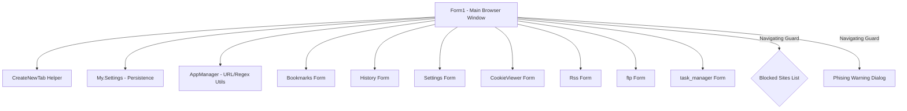

# K-Browser Codebase Documentation

K-Browser is a tabbed web browser application built using Visual Basic .NET (VB.NET) and Windows Forms. It integrates standard browsing features with advanced local utilities, such as a custom task manager, RSS reader, FTP client, and basic security filtering.

---

## 🏛️ Application Architecture & Component Diagram

The following diagram illustrates how the forms, utility classes, and user settings interact within the application:

---

## 📂 Codebase Component Registry

| Component File | Type | Description |
| :--- | :--- | :--- |
| [Form1.vb](file:///c:/Users/dennis/Documents/GitHub/k-browser/Form1.vb) | Form | **Main Form**. Coordinates tab control creation, navigation, back/forward history, print dialogs, page zoom, and window sizing. Integrates security interceptors for blocklists and phishing alerts. |
| [Settings.vb](file:///c:/Users/dennis/Documents/GitHub/k-browser/Settings.vb) | Form | **Configuration Panel**. Allows users to manage blocked/allowed site lists, enable the phishing filter, and execute a simple TCP port scanner. |
| [AppManager.vb](file:///c:/Users/dennis/Documents/GitHub/k-browser/AppManager.vb) | Class | **Utilities**. Contains regex validators for URLs, IP addresses, and emails, along with URL scheme fixes. |
| [History.vb](file:///c:/Users/dennis/Documents/GitHub/k-browser/History.vb) | Form | **History Viewer**. Lists visited sites from `My.Settings.History` and facilitates navigation or list-clearing. |
| [Bookmarks.vb](file:///c:/Users/dennis/Documents/GitHub/k-browser/Bookmarks.vb) | Form | **Bookmark Manager**. Displays saved pages and lets the user open them. |
| [Phising.vb](file:///c:/Users/dennis/Documents/GitHub/k-browser/Phising.vb) | Form | **Phishing Alert**. Decoupled warning dialog shown if the navigation guard intercepts a phishing URL. |
| [CookieViewer.vb](file:///c:/Users/dennis/Documents/GitHub/k-browser/CookieViewer.vb) | Form | **Cookie Manager**. legacy file utility to browse and delete cookies from the system folder. |
| [ftp.vb](file:///c:/Users/dennis/Documents/GitHub/k-browser/ftp.vb) | Form | **FTP Client**. Simple client to list, upload, download, and delete files on remote FTP servers. |
| [task manager.vb](file:///c:/Users/dennis/Documents/GitHub/k-browser/task%20manager.vb) | Form | **Task Manager**. Lists active machine processes with memory usage and responds to process termination commands. |
| [Rss.vb](file:///c:/Users/dennis/Documents/GitHub/k-browser/Rss.vb) | Form | **RSS Feed Reader**. Parses XML RSS feeds and presents headlines/links in a tree structure. |
| [AboutBox.vb](file:///c:/Users/dennis/Documents/GitHub/k-browser/AboutBox.vb) | Form | **About Box**. Standard application metadata dialog. |

---

## 🔒 Security & Navigation Guard Design
Navigation security is built into the browser's navigation lifecycle:
1. When a tab is created, it is registered to the `WebBrowser_Navigating` handler.
2. During the `Navigating` event, the target URL is normalized and matched against the user's blocklists.
3. If matched with `BlockedSites`, the navigation is cancelled (`e.Cancel = True`) and a blocking message is displayed.
4. If matched with `PhishingSites`, the `Phising` warning form is opened as a modal dialog:
   - **Ignore and continue**: Temporarily adds the URL to a session `IgnoredUrls` cache, allowing the user to browse without repeated warnings.
   - **Back**: Aborts navigation.

---

## ⚙️ Persistence & Settings Layout

K-Browser uses the built-in .NET Application Settings framework (`My.Settings`) for local configurations. The properties include:

- `MainSize`: Remembers the form height and width.
- `MainLocation`: Remembers the form window coordinates (saved on form closing).
- `History`: StringCollection containing visited URLs.
- `Bookmarks`: StringCollection containing saved bookmark URLs.
- `BlockedSites`: StringCollection containing user-specified blocked keyword/domain strings.
- `PhishingSites`: StringCollection containing phishing domain strings.
- `UsePhishingFilter`: Boolean setting to toggle phishing alerts.
- `PopUpBlockerEnabled`: Boolean to toggle pop-up blocker logic.
- `AllowedPopSites`: StringCollection of sites immune to pop-up blocks.
- `zoom`: Integer representing the zoom percentage.
